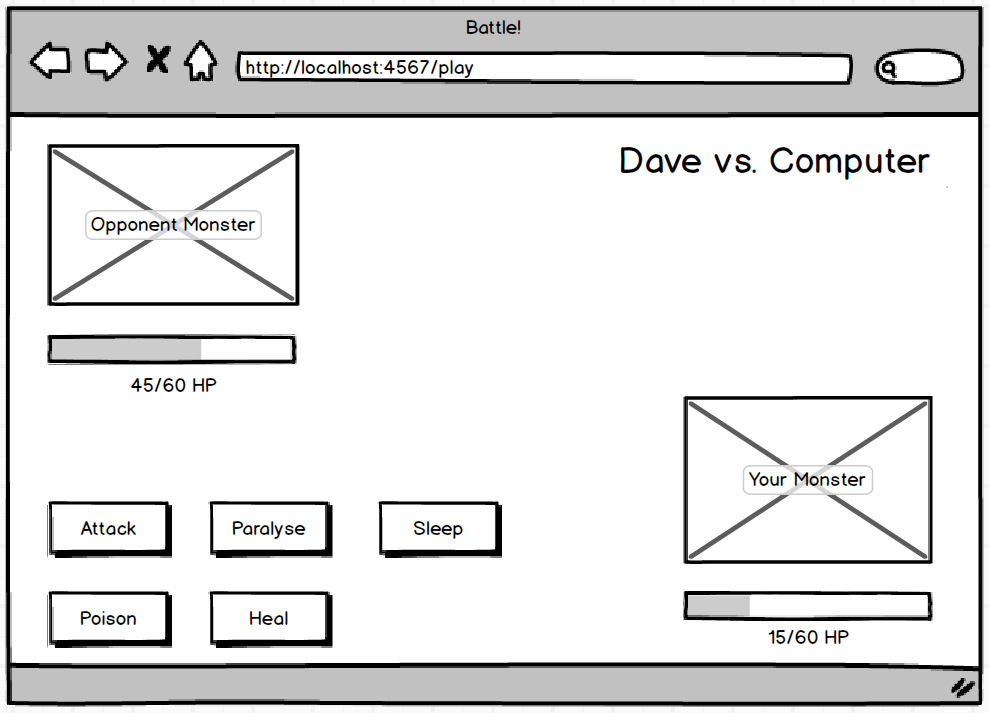

The project is called 'Battle'. Here is a mockup of how it might look towards the end:



### Challenge setup

Here are the complete User Stories for this project. They begin with some 'Basic' User Stories:

```
As two Players,
So we can play a personalised game of Battle,
We want to Start a fight by entering our Names and seeing them

As Player 1,
So I can see how close I am to winning
I want to see Player 2's Hit Points

As Player 1,
So I can win a game of Battle,
I want to attack Player 2, and I want to get a confirmation

As Player 1,
So I can start to win a game of Battle,
I want my attack to reduce Player 2's HP by 10

As two Players,
So we can continue our game of Battle,
We want to switch turns

As Player 1,
So I can see how close I am to losing,
I want to see my own hit points

As Player 1,
So I can lose a game of Battle,
I want Player 2 to attack me, and I want to get a confirmation

As Player 1,
So I can start to lose a game of Battle,
I want Player 2's attack to reduce my HP by 10

As a Player,
So I can Lose a game of Battle,
I want to see a 'Lose' message if I reach 0HP first
```

And some Advanced 'extension' User Stories:

```
As a Player,
So I can play a suspenseful game of Battle,
I want all Attacks to deal a random amount of damage

As a lonely Player,
So I can keep my Battle skills up to scratch
I want to play a Computerised opponent

As a Player,
So I can enjoy a game of Battle with more variety,
I want to choose from a range of attacks I could make

As a Player,
So I can better enjoy a game of Battle,
I want some of my attacks to Paralyse an opponent (chance of losing their next attack)

As a Player,
So I can better enjoy a game of Battle,
I want one of my attacks to have a chance of Poisoning my Opponent (Opponent takes a small random amount of damage at the beginning of their turn)

As a Player,
So I can better enjoy a game of Battle,
I want to make an attack that has a chance of sending my Opponent to Sleep (Opponent definitely misses next turn)

As a Player,
So I can extend my joyous experience of Battle,
I want to have an attack that heals some of my Hit Points

As a Player,
So I can enjoy my game of Battle,
I want a sexy user interface
```
